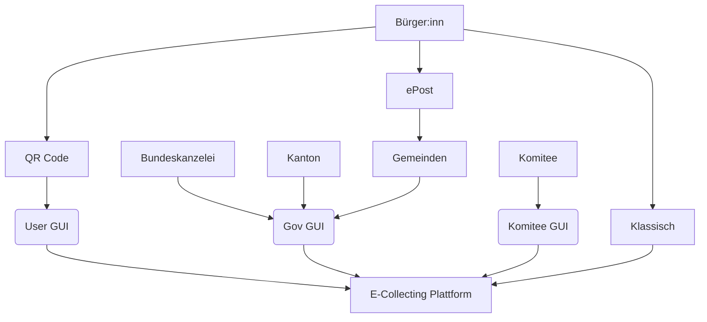
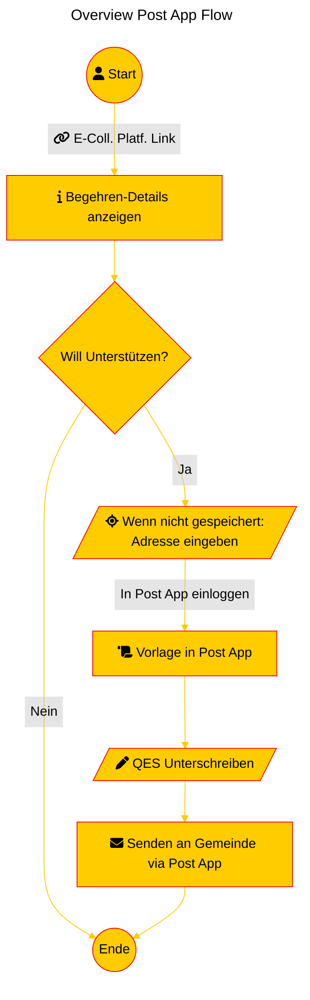

# 4) E-Collecting User Journey mit Nutzung der Erfahrung von SwissSign, ePost und E-Voting

*Over the course of two days, you will develop your solution for collecting electronic signatures for popular initiatives and referendums from A to Z, addressing the 10 topics outlined in the [guidelines](https://www.bk.admin.ch/bk/de/home/politische-rechte/e-collecting/aktuelles.html). Your prototype can be conceptual, clickable, and/or technical. Either way, you should clearly present the interactions and data flows between actors, software, and infrastructure components over time, as well as the user experience of these actors.*

## Approach

Die Schweizerische Post versteht sich seit jeher eine der Vertrauensinfrastruktur der Schweiz. 

Wo früher Briefe, Zahlungen oder amtliche Dokumente physisch zugestellt wurden, übernehmen heute digitale Dienste wie  

- SwissSign, - stellt digitale Zertifikate und Signaturen bereit 
- ePost – ist der digitale Briefkasten der Schweiz oder  
- E-Voting – elektronische Stimmabgebe  

 diese Rolle.  

E-Collecting kann nur funktionieren, wenn Bürgerinnen und Bürger Vertrauen in den Prozess haben. Die Post bringt dieses Vertrauen mit – durch, ihren gesetzlichen Auftrag, als Bundesnahesunternehmen und ihre Erfahrung im sicheren Informationsaustausch. Wir betrachten den gesamten Prozess – von der digitalen Unterstützungsbeurkundung bis zur Auszählung der Unterstützungsbekundungen: 

- Elektronisches Unterstützungsbeurkundung 
- Elektronisches Sammeln 
- Elektronische Prüfung
- Elektronisches Zählen 

Dabei liegt unser Fokus auf einer einfachen, nachvollziehbaren und barrierefreien User Journey für alle Beteiligten – Bürgerinnen, Komitees, Gemeinden & Kantone und die Bundeskanzlei. Vorschlag: E-Collecting in der Schweiz sollte sicher, transparent und für alle zugänglich sein. Im Rahmen dieses Hackathons wollen wir mit euch gemeinsam herausfinden: 

- Wie könnte eine E-Collecting-Customer-Journey aussehen, die sicher und nutzerfreundlich ist, und die das Vertrauen der Bevölkerung gewinnt? 
- Wie können wir eine praktikable Lösung finden, die Teilnahmegeheimnis und Verifizierbarkeit gewährleistet? Können wir die Erfahrungen der Post aus Projekten wie SwissSign, E-Voting und ePost nutzen, um eine solche Lösung zu finden?

## Topics addressed

| Topic | (How) is it addressed? |
| -| ------- |
| 1 | *Vom Unterstützungswillen zur Unterstützungsbekundung*   Das Teilen eines Links - durch QR-Code oder per Textnachricht - reicht.|
| 2 | *Zugang zu aktuellen Informationen über die eingereichten Unterstützungsbekundungen*   Basierend auf dem EKS. Durch optionale Integration mit ePost wird der Informationsfluss von Tagen auf Minuten beschleunigt. |
| 3 | *Zuschreibung der Unterstützungsbekundungen an Komitees und Sammelunternehmen*   Hash von Name und Adresse wird an e-Collecting Platform gesendet, zusammen mit der Komitee-ID welche den Link ausstellte. Nach Eintreffen der Verifizierung durch die Gemeinden kann Anzahl Übereinstimmungen gezählt werden.|
| 4 | *Unterbreitung von Argumenten der Komitees via E-Collecting*   Komitees können - soweit Weisungskonform - frei eine Website gestalten welche eingebettet angezeigt wird bevore eine Unterztützungsbekundung abgeben werden kann.|
| 5 | *Ausschluss unrechtmässiger Unterstützungsbekundungen*   Durch die Qualified Electronic Signature deutlich stärker erreicht als bisher.|
| 6 | *Verhinderung unterschlagener Unterstützungsbekundungen*   Hier kann das Know How von E-Voting genutzt werden.|
| 7 | *Wahrung des Stimmgeheimnisses*   Status Quo, etwas besser in Strassensammlungs-Situation|
| 8 | *Integration mit dem papierbasierten Prozess*   Unser Prozess benutzt vorhandene Infrastruktur and Datenflüsse|
| 9 | *Erleichterte Einführung für Gemeinden mit Effizienzgewinn; auf der Grundlage von bestehender Infrastruktur und bestehenden Prozessen*   Hier kann das Know How von E-Voting genutzt werden.|

### Goals and Requirements

| Goal / Requirement | Beschreibung | Muss / Kann
| - | ------- | -
| Nationale Lösung | Die Lösung soll alle Ebenen abdecken | Muss
| Papier und Digital | Alle abgegebene Unterstützungsbekundungen sollen für die Bescheinigung digitalisert sein | Muss
| Souveränität der Stakeholders | Bescheinigung für alle Kanäle (Papier und Digital) ist bei den Gemeinden | Muss
| Identifikation & Authorizierung | Eindeutige Identifikation & Authentifizierung für die Beurkudung durch elektronische ID für den digitalen Kanal; es wird keine digitale Unterschrift benötigt, ist aber möglich | Muss
| Mehrfache Unterstützungbekundung Verbieten | Die erste Unterstützungsbekundung gilt, mehrfache Unterstützungsbekundungen müssen entdeckt werden (innerhalb einer Gemeinde und vom Kanton) | Muss
| Nichtabstreitbarkeit & Nachvollziehbarkeit | Eine Person kann nicht seine Unterstützungsbekundung widerrufen und kann nicht bestreiten seine Unterstüzungsbekundung abgegeben zu haben. Es ist Nachvollziehbar wer was wann gemacht hat.   Bestätigung der Unterstützungsbeurkundung; der Stimmberechtigter muss wissen können ob er eune Unterstützungsbekundung abgegeben hat oder nicht. | Muss
| Stimmgeheimnis (1) | Stufe 1 | Muss
| Verifizierter Unterstützungsbekundungsammler | Es ist nachvollziehbar für welches "Komitee" eine Unterstützungbekundung eingegangen ist | Kann
| Stimmgeheimnis (2) | Stufe 4 | Kann
| Count-as-recorded | Benötigt die Krypto | Kann
| Participation-as-intended | Benötigt die Krypto | Kann

## Key Strenghts and Weaknesses

### Strengths:
- Know How aus E-Voting 
- Capabilities der sicheren Zustellung mit ePost
- Capabilities bezüglich Unterschriften mit SwissSign

## Contributing

Please read [CONTRIBUTING.md](/CONTRIBUTING.md) for details on our code of conduct.

## Team Members

- Amina Bouzar
- Jörg Scchorr
- Marcel Eichmüller
- Roman Riesen
- Leonardo Moretti
- Lukas Erni
- Audhild Høgåsen

## Finale Abschlusspräsentation 

### Recap & Herausforderungen 
Wir sind mit den Erfahrungen aus dem Bereichen ePost, SwissSign, E-Voting und 4 neuen Gspänlis zusammengekommen und haben uns überlegt wie ein möglicher Lösungsansatz für E-Collecting aussehen kann. In einem ersten Schritt haben wir uns auf die wertvolle Expertise E-Voting Team gestützt aus der Kryptographie, mit dem Ziel ein Lösungsansatz zu finden für E-Collecting mit Stimmgeheiniss. Wir haben das Thema sehr spannend gefunden, wir aber beschlossen haben dies nicht im Hackathon weiterzuverfpolgen. So sind wir zum jetzigen Lösungsansatz gekommen, wie ein möglicher Lösungsansatz für E-Collecting sein könnte. Dahinter ist viel mehr, wir zeigen euch jetzt einfach ein Snippet aus dem Big Picture, damit ihr seht was wir meinen. 

### Prototyp / Demo 
#### Grundkonzept

    
#### User Journey

Unser Ansatz fügt sich in bisherige Strukturen auf allen Verwaltungsebenen ein, für Verwaltungen und EKS Hersteller ändert sich nur so viel wie sie wollen.

### Vor- & Nachteile
#### Vorteil
- Vollständige Audits möglich
- Schnell umsetztbar, keine Anpassung von e-CH Standarts oder Einwohner Kontrollsoftware nötig.
- Setzt auf bereits Bestehendem: Laufende, rechtsgültige Authentifizierung als Grundlage
- Stimmbürger:in erhält eine Bestätigung in ePost Briefkasten
- Fraud bekämpfung zu Doppelunterschriften
- Integration E-ID ist möglich
- Einfach erweiterbar und in Zukünftige, komplexere Lösungen integrierbar
- Komitees haben eine aktuellere Übersicht
- Schlechte Anreize der Komitees werden partiell dadurch reduziert, dass nur gültige Stimmen zu ihrem Kontingent Zählen

#### Nachteil
- Die Gemeinde muss an die ePost angebunden sein
- Kaum Wahrung des Stimmgeheimnisses (Äquivalent, bis leicht verbessert im Vergleich mit bisherigem Verfahren)

#### Herausforderungen des Lösungsansatz  
- Der Stimmbürger:in muss den digitalen Briefkasten der Post aktiviert haben
- Um grösstmögliche Entlastung der Gemeinden zu realisieren ist eine Integrierung in das EKS nötig

## Vielen Dank an alle aus der Gruppe 4 für die hitzigen Diskussionen, das zusammen Nachdenken und das Erarbeiten eines möglichen Lösungansatzes. 

This software is licensed under a AGPL 3.0 License - see the [LICENSE](LICENSE) file for details. Please feel free to [choose any other](https://choosealicense.com/) [Open Source Initiative approved license](https://opensource.org/licenses) (e.g. a permissive license such as [MIT](https://opensource.org/license/mit)). Other content (e.g. text, images, etc.) is licensed under a [Creative Commons CC BY-SA 4.0 license](https://creativecommons.org/licenses/by-sa/4.0/deed.de). Exceptions are possible in consultation with the organizers.
