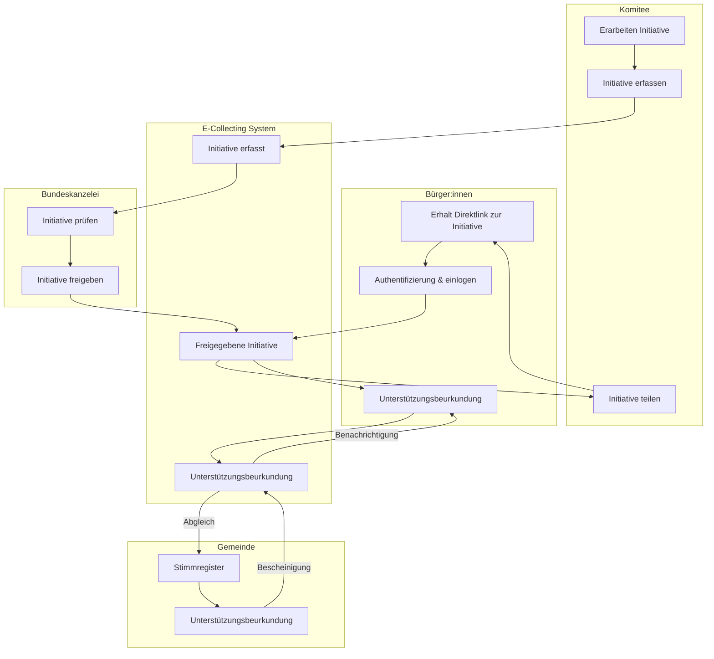

# 4) E-Collecting User Journey mit Nutzung der Erfahrung von SwissSign, ePost und E-Voting

*Over the course of two days, you will develop your solution for collecting electronic signatures for popular initiatives and referendums from A to Z, addressing the 10 topics outlined in the [guidelines](https://www.bk.admin.ch/bk/de/home/politische-rechte/e-collecting/aktuelles.html). Your prototype can be conceptual, clickable, and/or technical. Either way, you should clearly present the interactions and data flows between actors, software, and infrastructure components over time, as well as the user experience of these actors.*

## Approach

Die Schweizerische Post versteht sich seit jeher eine der Vertrauensinfrastruktur der Schweiz. 

Wo früher Briefe, Zahlungen oder amtliche Dokumente physisch zugestellt wurden, übernehmen heute digitale Dienste wie  

- SwissSign, - stellt digitale Zertifikate und Signaturen bereit 
- ePost – ist der digitale Briefkasten der Schweiz oder  
- E-Voting – elektronische Stimmabgebe  

 diese Rolle.  

E-Collecting kann nur funktionieren, wenn Bürgerinnen und Bürger Vertrauen in den Prozess haben. Die Post bringt dieses Vertrauen mit – durch, ihren gesetzlichen Auftrag, als Bundesnahesunternehmen und ihre Erfahrung im sicheren Informationsaustausch. Wir betrachten den gesamten Prozess – von der digitalen Unterstützungsbeurkundung bis zur Auszählung der Unterstützungsbekundungen: 

- Elektronisches Unterstützungsbeurkundung 
- Elektronisches Sammeln 
- Elektronische Prüfung
- Elektronisches Zählen 

Dabei liegt unser Fokus auf einer einfachen, nachvollziehbaren und barrierefreien User Journey für alle Beteiligten – Bürgerinnen, Komitees, Gemeinden & Kantone und die Bundeskanzlei. Vorschlag: E-Collecting in der Schweiz sollte sicher, transparent und für alle zugänglich sein. Im Rahmen dieses Hackathons wollen wir mit euch gemeinsam herausfinden: 

- Wie könnte eine E-Collecting-Customer-Journey aussehen, die sicher und nutzerfreundlich ist, und die das Vertrauen der Bevölkerung gewinnt? 
- Wie können wir eine praktikable Lösung finden, die Teilnahmegeheimnis und Verifizierbarkeit gewährleistet? Können wir die Erfahrungen der Post aus Projekten wie SwissSign, E-Voting und ePost nutzen, um eine solche Lösung zu finden? 

  
## Documentation and Diagrams

### Flowchart: High-level Process (First Example)

*An overall process flow showing the main steps and system/actor interactions for ordering a pizza online via a delivery website, including software, infrastructure, and handoff to the restaurant and delivery driver.*

## Topics addressed

| Topic | (How) is it addressed? |
| -| ------- |
| 1 | *Vom Unterstützungswillen zur Unterstützungsbekundung*   Mit dem Lösungsansatz wollen wir eine User-Journey erarbeiten für einen nationalen E-Collecting Ansatz.|
| 2 | *Zugang zu aktuellen Informationen über die eingereichten Unterstützungsbekundungen*   Hier könnten die Capabilities von ePost genutzt werden. |
| 3 | *Zuschreibung der Unterstützungsbekundungen an Komitees und Sammelunternehmen*   Hier könnten die Capabilities von ePost genutzt werden. |
| 4 | *Unterbreitung von Argumenten der Komitees via E-Collecting*   Hier könnten die Capabilities von ePost genutzt werden.|
| 5 | *Ausschluss unrechtmässiger Unterstützungsbekundungen*   Hier kann das Know How von E-Voting genutzt werden.|
| 6 | *Verhinderung unterschlagener Unterstützungsbekundungen*   Hier kann das Know How von E-Voting genutzt werden.|
| 7 | *Wahrung des Stimmgeheimnisses*   Gemeinsam definieren welche Stufe E-Collecting erreichen sollte. Hier kann das Know How von E-Voting genutzt werden.|
| 8 | *Integration mit dem papierbasierten Prozess*   Gemeinsam definieren welche Stufe E-Collecting erreichen sollte. Hier kann das Know How von E-Voting genutzt werden.|
| 9 | *Erleichterte Einführung für Gemeinden mit Effizienzgewinn; auf der Grundlage von bestehender Infrastruktur und bestehenden Prozessen*   Hier kann das Know How von E-Voting genutzt werden.|

## Key Strenghts and Weaknesses

### Strengths:
- Know How aus E-Voting 
- Capabilities der sicheren Zustellung mit ePost
- Capabilities bezüglich Unterschriften mit SwissSign

## Contributing

Please read [CONTRIBUTING.md](/CONTRIBUTING.md) for details on our code of conduct.

## Team Members

- Amina Bouzar
- Jörg Scchorr
- Marcel Eichmüller
- Roman Riesen
- Leonardo Moretti
- Lukas Erni
- Audhild Høgåsen

This software is licensed under a AGPL 3.0 License - see the [LICENSE](LICENSE) file for details. Please feel free to [choose any other](https://choosealicense.com/) [Open Source Initiative approved license](https://opensource.org/licenses) (e.g. a permissive license such as [MIT](https://opensource.org/license/mit)). Other content (e.g. text, images, etc.) is licensed under a [Creative Commons CC BY-SA 4.0 license](https://creativecommons.org/licenses/by-sa/4.0/deed.de). Exceptions are possible in consultation with the organizers.
