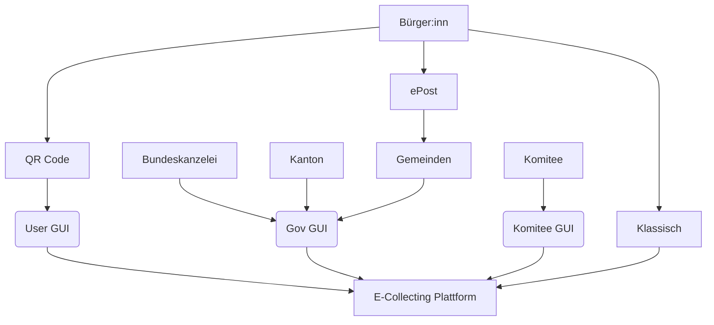
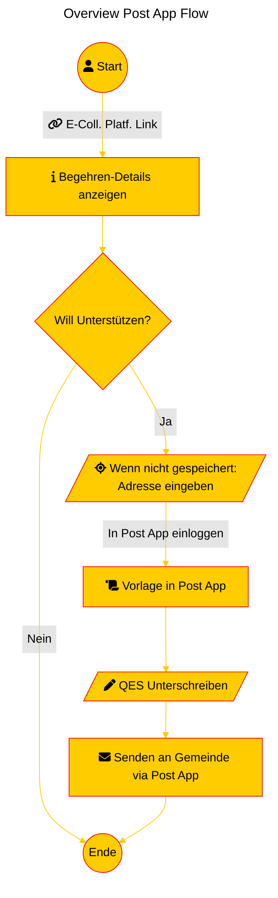

## Finale Abschlusspräsentation 

### Recap & Herausforderungen 
Wir sind mit den Erfahrungen aus dem Bereichen ePost, SwissSign, E-Voting und 4 neuen Gspänlis zusammengekommen und haben uns überlegt wie ein möglicher Lösungsansatz für E-Collecting aussehen kann. In einem ersten Schritt haben wir uns auf die wertvolle Expertise E-Voting Team gestützt aus der Kryptographie, mit dem Ziel ein Lösungsansatz zu finden für E-Collecting mit einem möglichst hohen Stimmgeheiniss, aber einer einfachen Lösung. Wir haben das Thema sehr spannend gefunden, aber beschlossen dies Thema  nicht im Hackathon weiterzuverfolgen. So sind wir zum jetzigen Lösungsansatz gekommen, ein möglicher Lösungsansatz für E-Collecting. Dahinter ist viel mehr, wir zeigen euch jetzt einfach ein Ausschnitt aus dem Big Picture, damit ihr seht was wir meinen. 

### Prototyp / Demo 
#### Grundkonzept


    
#### User Journey





Unser Ansatz fügt sich in bisherige Strukturen auf allen Verwaltungsebenen ein, für Verwaltungen und EKS Hersteller ändert sich nur so viel wie sie wollen.

### Vor- & Nachteile
#### Vorteil
- Vollständige Audits möglich
- Schnell umsetztbar, keine Anpassung von e-CH Standarts oder Einwohner Kontrollsoftware nötig.
- Setzt auf bereits Bestehendem: Laufende, rechtsgültige Authentifizierung als Grundlage
- Stimmbürger:in erhält eine Bestätigung in ePost Briefkasten
- Fraud bekämpfung zu Doppelunterschriften
- Integration E-ID ist möglich
- Einfach erweiterbar und in Zukünftige, komplexere Lösungen integrierbar
- Komitees haben eine aktuellere Übersicht
- Schlechte Anreize der Komitees werden partiell dadurch reduziert, dass nur gültige Stimmen zu ihrem Kontingent Zählen

#### Nachteil
- Die Gemeinde muss an die ePost angebunden sein
- Teilweise Wahrung des Stimmgeheimnisses (verbessert im Vergleich mit bisherigem pyhsichen Verfahren)

#### Herausforderungen des Lösungsansatz  
- Der Stimmbürger:in muss den digitalen Briefkasten der Post aktiviert haben
- Um grösstmögliche Entlastung der Gemeinden zu realisieren ist eine Integrierung in das EKS nötig

## Vielen Dank an alle aus der Gruppe 4 für die Diskussionen, das zusammen Nachdenken und das Erarbeiten eines möglichen Lösungansatzes. 

This software is licensed under a AGPL 3.0 License - see the [LICENSE](LICENSE) file for details. Please feel free to [choose any other](https://choosealicense.com/) [Open Source Initiative approved license](https://opensource.org/licenses) (e.g. a permissive license such as [MIT](https://opensource.org/license/mit)). Other content (e.g. text, images, etc.) is licensed under a [Creative Commons CC BY-SA 4.0 license](https://creativecommons.org/licenses/by-sa/4.0/deed.de). Exceptions are possible in consultation with the organizers.


# Appendix

## Sequence Diagram (unfinished)

Annahmen sind, dass Bürger*innen, respektive deren Anfragen, authentifiziert sind etwa durch ePost oder eID. Die authentifizierung ist nicht abgebildet.

```mermaid
---
title: Overview
format: revealjs
include-in-header: 
  text: |
    <link rel="stylesheet" href="https://cdnjs.cloudflare.com/ajax/libs/font-awesome/6.4.0/css/all.min.css">
config:
  theme: 'base'
  themeVariables:
    primaryColor: '#cc9900'
    primaryTextColor: '#fff'
    primaryBorderColor: '#555'
    lineColor: '#ff0000'
    secondaryColor: '#ff0000'
    tertiaryColor: '#ff0000'
---

sequenceDiagram
    actor Komitee as Komitee
    actor A as Bürger*innen
    participant Ecolli as E-Collecting<br/>Platform<br/>Bei Kanton
    critical Einreichung
        Komitee ->>+ Ecolli: Einreichen von (I)
        Ecolli ->> Ecolli: Überprüfung
        Ecolli ->>+ Gem: Neue Initiative (I)
    end
    critical Kreieren von Komitee
        %%%create participant Komitee
        Komitee ->>+ Ecolli: 
        Ecolli ->> Ecolli: Überprüfung
        Ecolli ->> Ecolli: Neue KomiteeId 
        Ecolli ->>+ Komitee: Neue KomiteeId {I, KomiteeId}
    end
    participant Gem as Gemeinde <br> Einwohner Kontrollsystem
    critical  E-Collecting Sammlung
        Komitee ->>+ A: Link(KomiteeId, I)
        A ->>+ Gem: E-Unterschrift <br>{name, adresse, I, P_k}
        %%A ->>+ Ecolli: (KomiteeId, Hash({I, name, adresse, plz}))
        Gem ->>+ Gem: Überprüfung <br/> (manuell oder automatisch)
        Gem ->>+ Ecolli: Verifizierte Unterschriften<br>[{I, ahv, name, adresse, scan, ...}]
        %%Ecolli ->>+ Ecolli: Abgleich der Hashes<br>& Auszählen der Komitees
        Ecolli ->>+ Komitee: Anzahl gesammelter Stimmen 
    end

    %%critical  Physische Sammlung
    %%    A ->>+ Komitee: Unterschriftsbogen
    %%    Komitee ->>+ Gemeinde: Unterschriftsbogen
    %%    %%Ecolli ->>+ Ecolli: Scan & OCR
    %%    %%Ecolli ->>+ Gem:E-Unterschrift $$(Addr, I)$$ 
    %%    %%Ecolli ->>+ Gem:Unterschrift Bögen
    %%    Gem ->>+ Gem: Überprüfung & Scan <br/> (manuell oder automatisch)
    %%    Gem ->>+ Ecolli: Überprüfte Unterschriften<br>[{ahv, name, adresse, scan, ...}]
    %%    Gem ->>+ Bundeskanzlei: Unterschriftsbogen 
    %%    Bundeskanzlei ->>+ Bundeskanzlei: Zählen der Komitee

    %%end

    %%opt Optionale Alternative Physische Sammlung zur Entlastung der Gemeinde
    %%    A ->>+ Ecolli: Unterschriftsbogen
    %%    Ecolli ->>+ Ecolli: Scan & OCR
    %%    Ecolli ->>+ Gem:Hybrid-Unterschrift (Addr, I, Scan) 
    %%    Gem ->>+ Gem: Überprüfung <br/> (manuell)
    %%    Gem ->>+ Ecolli: Überprüfte Unterschriften
    %%end

    opt Später
        A ->>+ Ecolli: habe ich (I) unterschrieben?
        activate Ecolli
        Ecolli ->>+ A: Ja/Nein
    end

    par Nach Ablauf der Unterschriftenfrist
        Ecolli ->>+ Ecolli: Unterschriften für (I) löschen
        Ecolli ->>+ Ecolli: Zerstörung der Unterschriftsbögen
        Gem ->>+ Gem: Zerstörung der Unterschriftsbögen
    end

    %%actor G as Gemeinde Mitarbeiter*in
    %%Alice->>+John: Hello John, how are you?
    %%Alice->>+John: 
    %%John-->>-Alice: 
    %%John-->>-Alice: 
    
