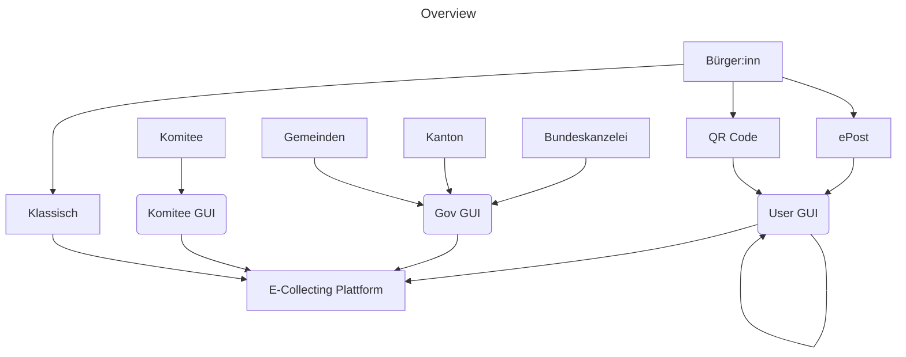

```mermaid
---
title: Overview
format: revealjs
include-in-header: 
  text: |
    <link rel="stylesheet" href="https://cdnjs.cloudflare.com/ajax/libs/font-awesome/6.4.0/css/all.min.css">
---

flowchart TD
    B["User GUI"] --> A["E-Collecting Plattform"]
    B-->B
    C["Gov GUI"] --> A
    D["Komitee GUI"] --> A
    C1["Bundeskanzelei"] --> C
    C2["Kanton"] --> C
    C3["Gemeinden"] --> C
    B1["ePost"] --> B
    B2["QR Code"] --> B
    E["Komitee"] --> D
    F["Bürger:inn"] --> B1 & B2 & B3["Klassisch"]
    B3 --> A
    B@{ shape: rounded}
    C@{ shape: rounded}
    D@{ shape: rounded}
```
