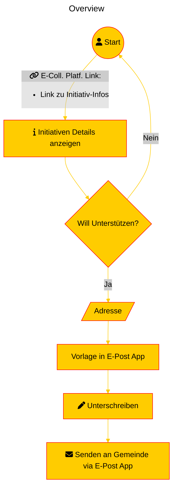

```mermaid
---
title: Overview
format: revealjs
include-in-header: 
  text: |
    <link rel="stylesheet" href="https://cdnjs.cloudflare.com/ajax/libs/font-awesome/6.4.0/css/all.min.css">
config:
  theme: 'base'
  themeVariables:
    primaryColor: '#ffcc00'
    primaryTextColor: '#000'
    primaryBorderColor: '#ff0000'
    lineColor: '#ffcc00'
    secondaryColor: '#ccc'
    tertiaryColor: '#000'
---

flowchart TD
    A((fa:fa-user Start)) -->|fa:fa-link E-Coll. Platf. Link: <ul align="left"><li>Link zu Initiativ-Infos</li></ul>| B
    B[fa:fa-info Initiativen Details anzeigen] --> C{Will Unterstützen?}
    C -->|Ja| F[/ Adresse /]
    C -->|Nein| A
    F --> D[Vorlage in E-Post App]
    D --> G[fa:fa-pen Unterschreiben]
    G --> Gem[fa:fa-envelope Senden an Gemeinde via E-Post App]
```
