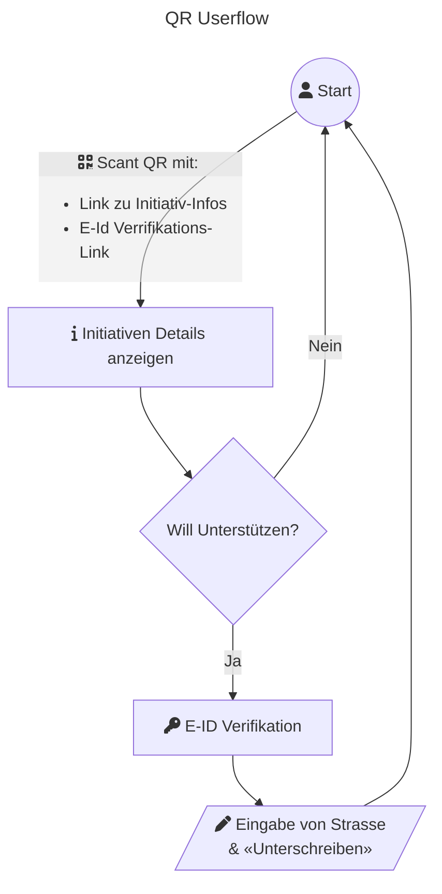

```mermaid
---
---
title: QR Userflow
format: revealjs
include-in-header: 
  text: |
    <link rel="stylesheet" href="https://cdnjs.cloudflare.com/ajax/libs/font-awesome/6.4.0/css/all.min.css">
---

flowchart TD
    A((fa:fa-user Start)) -->|fa:fa-qrcode Scant QR mit: <ul align="left"><li>Link zu Initiativ-Infos</li><li>E-Id Verrifikations-Link</li></ul>| B
    B[fa:fa-info Initiativen Details anzeigen] --> C{Will Unterstützen?}
    C -->|Ja| F
    C -->|Nein| A
    F[fa:fa-key E-ID Verifikation] --> D[/fa:fa-pen Eingabe von Strasse <br> &amp «Unterschreiben»/]
    D --> A
```
