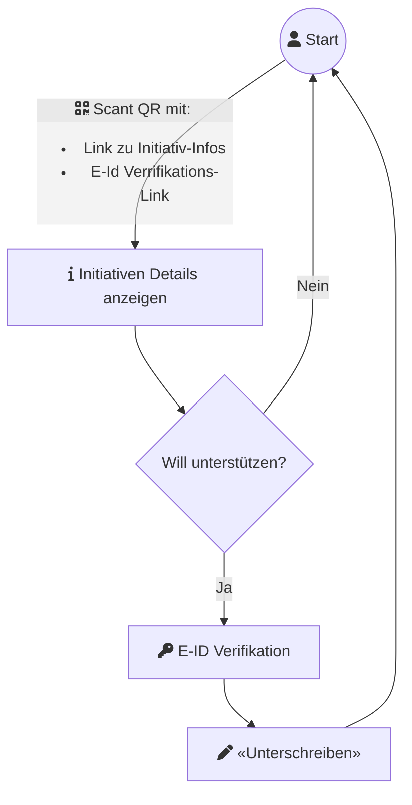

```mermaid
flowchart TD
    A((fa:fa-user Start)) -->|fa:fa-qrcode Scant QR mit: <ul><li>Link zu Initiativ-Infos</li><li>E-Id Verrifikations-Link</li></ul>| B
    B[fa:fa-info Initiativen Details anzeigen] --> C{Will unterstützen?}
    C -->|Ja| F
    C -->|Nein| A
    F[fa:fa-key E-ID Verifikation] --> D[fa:fa-pen «Unterschreiben»]
    D --> A
```
